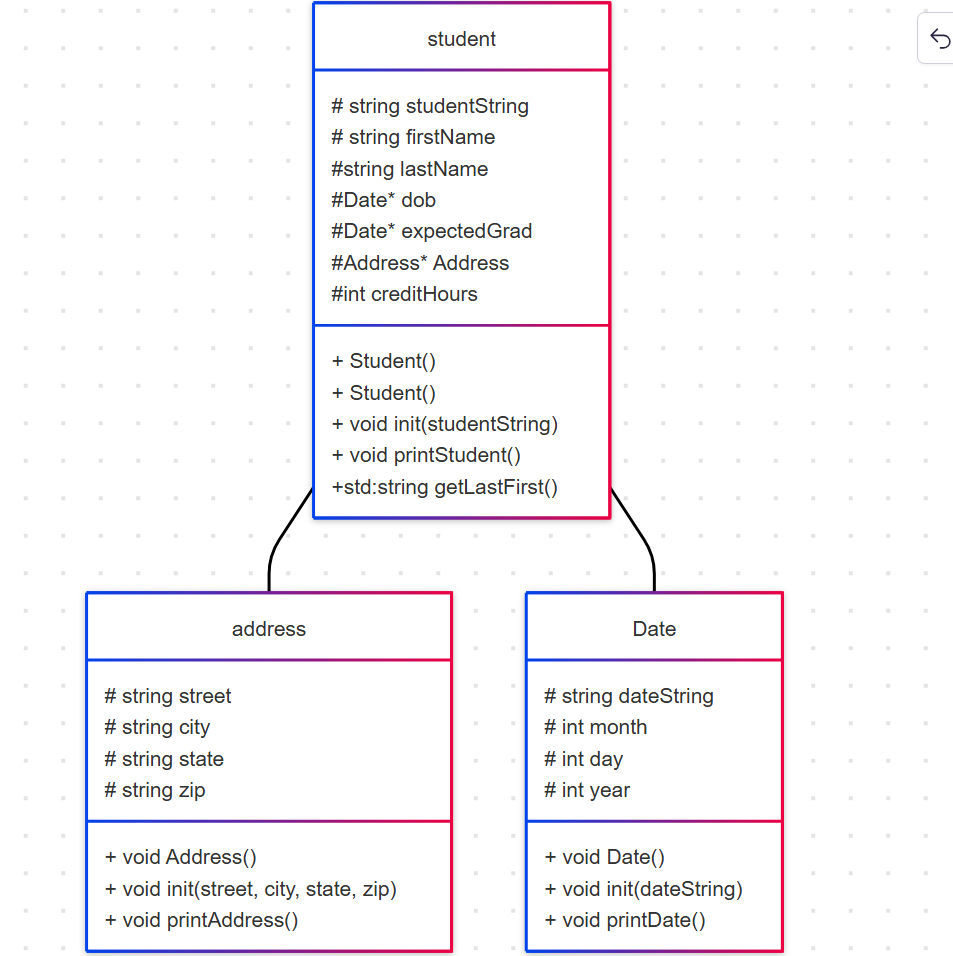

# cs121project6
https://www.mermaidchart.com/app/projects/3faa3484-db3c-4993-a8e4-42737a73aa80/diagrams/98cdd012-70ce-41a4-a2c9-efeafcaa64e0/version/v0.1/edit
Picture

 

Student 
-Student init(studentString)take entire string and conduct a purese
- Will convert credit hour string and assign 
-Create date dob instance on the heap 
-Create date gradDate on heap
-Create an Address instance on the heap

Address
-Instances of Address will be created on the heap
Initialize the Address objects with 4 string arguments street, city, state, zip
- With a printAddress function

Date 
Instances of the date will be created on the heap
Create seperate instances for a student's date of birth and a student's expected gradution date
-the instances wull intilialize with a string date format of MM/DD/YYYY
-Print in "Month DD, YYYY" format

 

